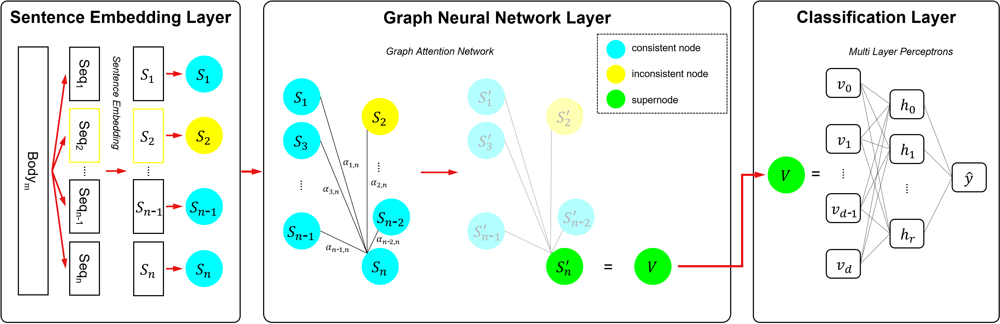

# GraDID: Detecting Documents With Inconsistent Context
This repository contains official code of **Detecting Documents With Inconsistent Context** [(link)](https://ieeexplore.ieee.org/document/9875276). This model, named GraDID, is a Graph-based Document Inconsistency Detection model to detect document content's contextual consistency. We regard to contents by sequence-level(sentence or paragraph) and each sequence turn into a node which used in graph structure. First, split the document into sequences in a Sentence Embedding Layer, and sentence embedding nodes propagate each other to make a supernode in a Graph Neural Network Layer. The supernode is classified through MLP as having consistent context or not in a Classification Layer. 



To use this model, you need to install [PyTorch](https://pytorch.org/) and [PyTorch Geometric](https://pytorch-geometric.readthedocs.io/en/latest/notes/installation.html). You can install PyTorch Geometric by using pip:
```bash
# Install library
pip install -r requirements.txt
```
To run this model, follow these steps.

## Get the Data
### NELA17
1. Download [nela-17](https://github.com/BenjaminDHorne/NELA2017-Dataset-v1)
2. To make incongruent content of news, refer to [previous preprocessing method](https://github.com/sugoiii/detecting-incongruity-dataset-gen).
3. Put the data in `'data/nela/'` directory.
### YonHap News in Korean (YH-News)
- ToDo (We won't release the raw data of YH due to policy, but we plan to release the preprocessed numpy array data.)

## Data Preprocessing
Extract sentence-level embedding of news and save embedding as numpy array. The raw text embeddings are saved in `save_embedding/'` directory. We use pretrained `sentence-transformers` via [sbert.net](https://www.sbert.net/docs/pretrained_models.html). To get more models, explore [huggingface](https://huggingface.co/sentence-transformers).
### NELA17
```python
python sentence_embedding.py --sentence_model='all-roberta-large-v1' --seq_level='paragraph'
```
### YonHap News in Korean (YH-News)
```python
python sentence_embedding.py --data_info='yh' --sentence_model='Huffon/sentence-klue-roberta-base' 
```

## Train and Evaluation
### Nela-17
```python
python main.py --embedding_model='all-roberta-large-v1' --lr=1e-4 --dropout_p=0.2
# if want only train, add --only_train
```
If you already have trained model, you can evaluate the model by using `--only_test` and adding `--load_path=PATH` options.
```python
python main.py --embedding_model='all-roberta-large-v1' --lr=1e-4 --dropout_p=0.2 --only_test --load_path=SAVED_MODEL_PATH
```
### YH
```python
python main.py --data_info='yh' --embedding_model='Huffon/sentence-klue-roberta-base' --lr=1e-3 --dropout_p=0.5
```

## Cite
```bibtex
@article{jung2022detecting,
  title={Detecting Documents With Inconsistent Context},
  author={Jung, Dongin and Kim, Misuk and Cho, Yoon-Sik},
  journal={IEEE Access},
  year={2022},
  publisher={IEEE}
}
```

## Contact
If you have any questions, please contact us via email: `dongin1009@gmail.com`
